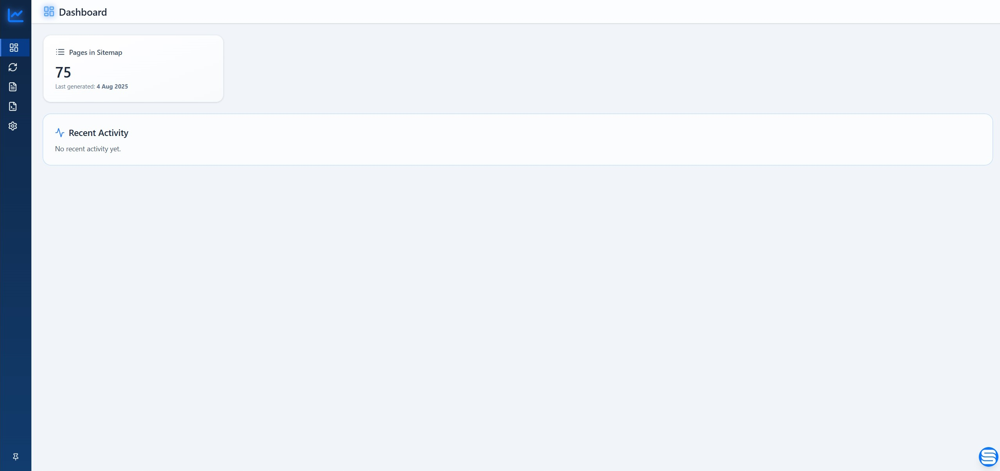
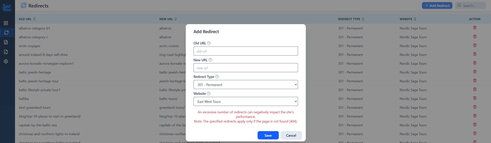
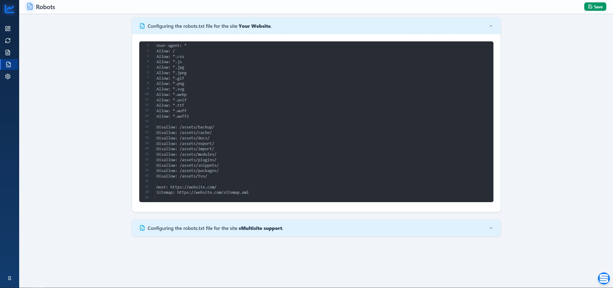
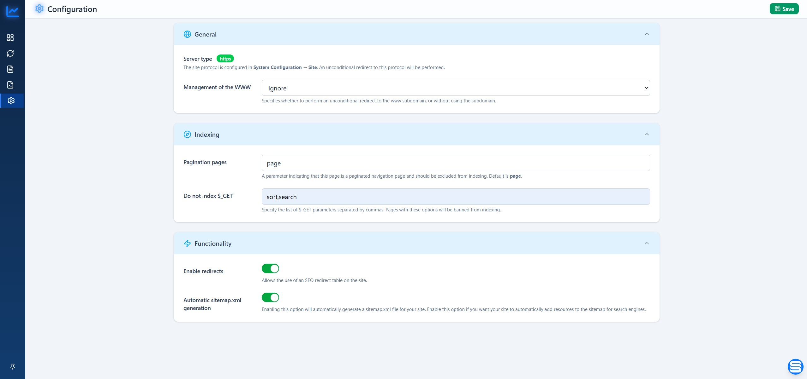
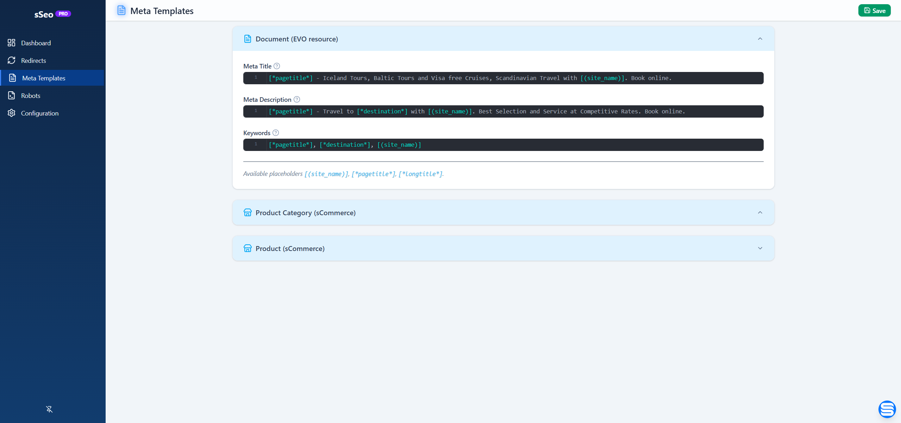

# Przewodnik uzytkownika

## Gdzie otworzyc sSeo

Otworz **Manager -> Tools -> sSeo**. Modul dziala wewnatrz managera Evolution CMS i utrzymuje swoje zakladki w jednym workspace.

Glowne zakladki:

- **Dashboard** - status sitemap i ostatnia aktywnosc SEO.
- **Redirects** - zarzadzanie przekierowaniami 301/302.
- **Robots** - edytor robots.txt.
- **Analytics** - Google Tag Manager i Google Analytics 4 IDs.
- **Configuration** - indeksowanie, funkcje, commerce i ustawienia serwera.
- **Meta Templates** - szablony PRO, gdy powierzchnia PRO jest dostepna.

## Dashboard

Dashboard pokazuje aktualny plik sitemap, liczbe URL, date ostatniego generowania i ostatnia aktywnosc.

Sprawdzaj te zakladke po zmianie tresci lub ustawien sitemap, aby potwierdzic, ze generowanie nadal dziala poprawnie.

## Redirects

Przekierowania pomagaja obslugiwac stare lub brakujace URL bez edycji konfiguracji serwera.

Typowy workflow:

1. Otworz **Redirects**.
2. Dodaj stary URL bez domeny strony.
3. Dodaj nowy URL lub absolutny target.
4. Wybierz typ: `301` dla stalego przekierowania lub `302` dla tymczasowego.
5. Zapisz i sprawdz stary URL w przegladarce.

Gdy sMultisite jest wlaczony, przekierowania moga byc przypisane do site key. Przekierowania globalne moga byc wspoldzielone tam, gdzie pozwala na to konfiguracja.

## Robots

Zakladka Robots edytuje aktywna zawartosc robots.txt. W projekcie multisite sSeo moze pracowac z plikami per-site i fallbackiem do pliku root.

Uzywaj robots.txt do regul crawler-level. Do decyzji page-specific `index`, `noindex`, `follow` i `nofollow` uzywaj pol SEO zasobu.

## Analytics

Zakladka Analytics przechowuje Google IDs uzywane przez warstwe runtime injection.

- **Google Tag Manager** przyjmuje IDs po przecinku, np. `GTM-AAAAAAA`.
- **Google Analytics 4** przyjmuje IDs po przecinku, np. `G-XXXXXXXXXX`.

sSeo waliduje format ID przed zapisem. Pozostaw pole puste, jesli integracja nie jest uzywana.

## Configuration

Konfiguracja jest podzielona na sekcje.

### Indexing

- **Pagination parameter** oznacza parametr stron paginacji, ktore nie powinny byc indeksowane. Domyslnie `page`.
- **Noindex `$_GET`** przechowuje liste parametrow query po przecinku, ktore powinny dawac noindex.

### Functionality

- **Meta tags mode** okresla, jak sSeo obsluguje meta tags obecne juz w szablonie.
  - **Replace** nadpisuje pasujace tags przez output sSeo.
  - **Fill** dodaje tylko brakujace tags.
- **Enable redirects** wlacza lub wylacza tabele przekierowan.
- **Automatic sitemap generation** aktualizuje sitemap.xml po zmianach tresci.

### Commerce

Aliasy atrybutow produktu udostepniaja wybrane atrybuty sCommerce w szablonach SEO.

### Server

- **Server type** pokazuje aktywne ustawienie protokolu Evolution CMS.
- **WWW management** moze ignorowac WWW, przekierowywac na non-WWW albo na WWW.

## Meta Templates

Meta Templates to powierzchnia PRO. Definiuje fallback title, description i keywords dla dokumentow oraz zintegrowanych modulow.

Szablony moga uzywac placeholders:

- `[*pagetitle*]`
- `[*longtitle*]`
- `[(site_name)]`

Uzywaj templates dla spojnych wartosci domyslnych, a pojedyncze strony nadpisuj przez pola SEO zasobu.

## Pola SEO zasobu

sSeo dodaje pola SEO do zasobow i wspieranych edytorow modulow.

Typowe pola:

- robots behavior;
- meta title;
- meta description;
- meta keywords;
- canonical URL;
- wykluczenie z sitemap;
- sitemap priority;
- change frequency.

Jesli sLang jest wlaczony, dane SEO moga byc zapisywane per jezyk. Bez sLang sSeo uzywa bazowego rekordu SEO.

## Multisite

Gdy sMultisite jest wlaczony, sSeo uzywa aktywnego `site_key` dla robots.txt, sitemap.xml, redirects i SEO records tam, gdzie runtime wymaga separacji stron.

Po zmianie canonical redirects, robots rules lub sitemap behavior sprawdz kazda strone osobno.
